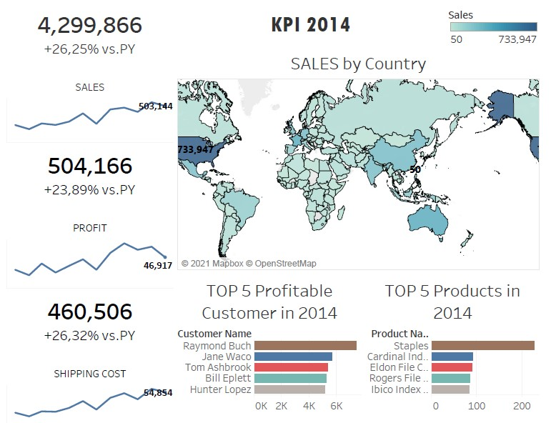
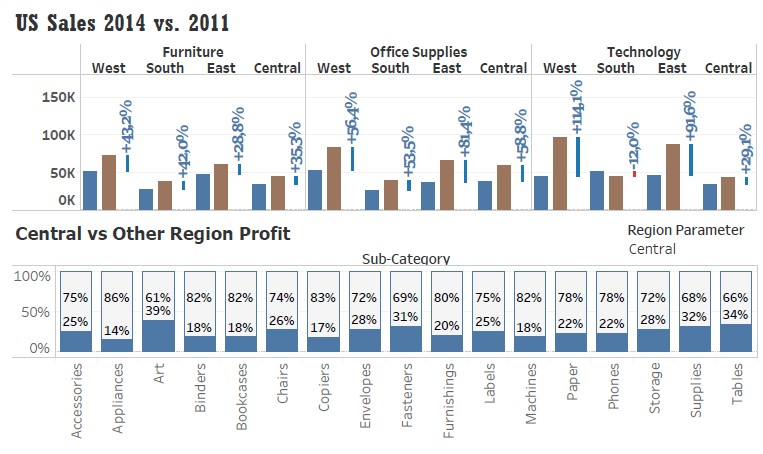

# commercial-tableau-uni-assessment
The university assessment required students to create a report and visualization using Tableau to derive commercial insights from a dataset provided.

Some of the visualization

The report can be found on pdf file
